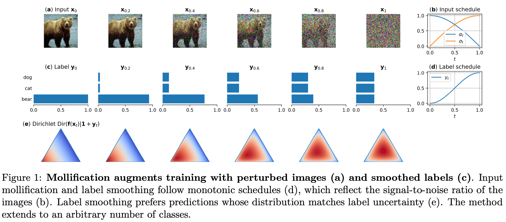

# Robust Classification by Coupling Data Mollification with Label Smoothing

Implementation of supervised mollification: couple image noising with label smoothing.

Code for paper [Robust Classification by Coupling Data Mollification with Label Smoothing](https://arxiv.org/abs/2406.01494) (AISTATS 2025) by Markus Heinonen, Ba-Hien Tran, Michael Kampffmeyer and Maurizio Filippone




## Abstract 

> Introducing training-time augmentations is a key technique to enhance generalization and prepare deep neural networks against test-time corruptions. Inspired by the success of generative diffusion models, we propose a novel approach of coupling data mollification, in the form of image noising and blurring, with label smoothing to align predicted label confidences with image degradation. The method is simple to implement, introduces negligible overheads, and can be combined with existing augmentations. We demonstrate improved robustness and uncertainty quantification on the corrupted image benchmarks of the CIFAR and TinyImageNet datasets.

## TLDR

We propose training image classifier by **augmenting training images with noise+blur**, and coupling this with corresponding amounts of **label smoothing**. 

In pseudo-code:

```python
def training_batch(x,y):

  t = uniform(x)  # in [0,1]

  # blur and noise input batch
  x = blur( x, schedule_blur(t) )    # scheduler for amount of blur 
  x = noise( x, schedule_noise(t) )  # scheduler for amount of noise

  # labels to onehot and then relax between [0,1]
  y = onehot(y)
  y = label_smooth( y, schedule_label(t) )  # scheduler for amount of label decay

  # predict/loss/backprop/train as usual
  logit = predict(x)
  loss = lossfunc(logit, y)

```

## Repository details

Repo supports CIFAR-10, CIFAR-100, TinyImagenet and various network architectures.

To reproduce paper results:
- Edit `config` file to add wandb details 
- Download CIFAR10/100/TinyImagenet (see `/data`), and run `data/process-datasets.py`. The code `src/data.py` expects datasets to be .npy files with (N,C,W,H) array inside
– Execute `runs_paper.sh` on a GPU cluster 

The code depends on
- pytorch
- lightning
- wandb
- omegaconf
- torch_dct

Use `train.py --help` to train models

Try example runs:

- `python3 train.py -d tin -n presnet50 --aug fcr trivaug`     (without mollification)
- `python3 train.py -d tin -n presnet50 --aug fcr trivaug -m`     (with mollification)

We obtain approximately errors of 
 - 5% CIFAR-10
 - 20% CIFAR-100
 - 32% TIN

## Contact

Feel free to contact me via email (markus.o.heinonen@aalto.fi) if you have any issues or questions.

## Citation

When using this repository in your work, please consider citing our paper

```
@inproceedings{heinonen2025,
  author    = {Markus Heinonen and Ba-Hien Tran and Michael Kampffmeyer and Maurizio Filippone},
  title     = {Robust Classification by Coupling Data Mollification with Label Smoothing},
  booktitle = {AISTATS},
  year      = {2025}
}
```
